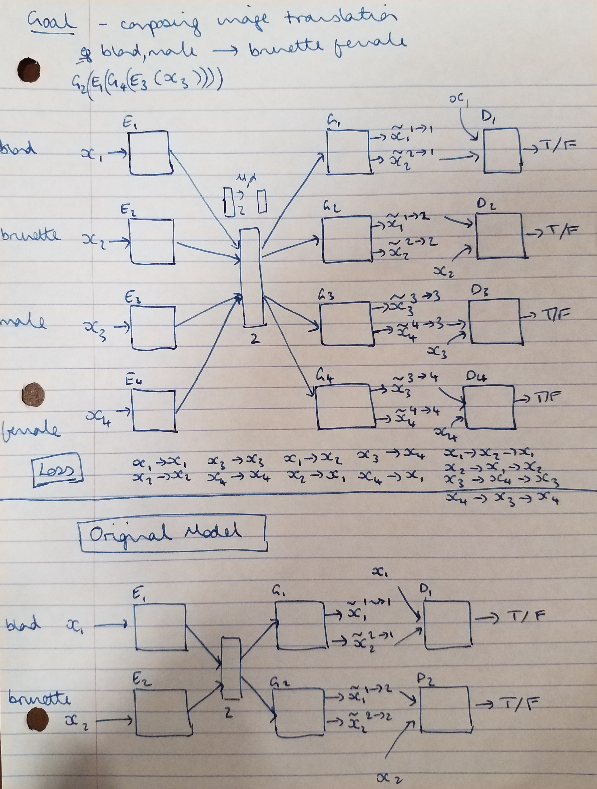

## Project Ideas

### General topic: Image to image Translation

Image to image translation is an interesting area of machine learning research. The goal is to be able to translate images from one domain / data distribution and translate them to a different distribution. If done well, this offers the possibility of augmenting datasets by translating commonly occurring images to less frequently occurring domains (e.g. from dry weather to snowy or rainy weather). It also offers the possibility of generating labels for unlabelled data, if there is a labelled domain that the unlabelled data could be translated to.

### im2im2im: Composing image translation from multiple domains

**The goal of this project**

The objective of this project is to compose image translations so that image components from multiple domains can be translated onto an original image.

For example:
- horse, summer -> zebra, winter
- man,brunette -> woman,blond

One challenge of multiple translations is that data containing all the possible translation permutations is difficult to find. One solution to this is to train a model that can translate the individual components, whilst retaining the other relevant features in the image. The source image could then be cycled twice through the network to achieve the desired double translation.

The question that this project aims to answer is whether it is possible to train a model that can de-compose `man, brunette -> woman, blond` into a two feature based translations `man - woman` and `brunette - blond`, that can be trained using only pairwise data distributions, and composed once training is finished.

Recent work by Liu, Breuel, and Kautz in which they map the different data distributions to a shared latent space is one approach that could be extended to more than one pair of translations in a single model. It is hoped that the shared latent space between the four distributions (man, woman, blond, brunette) will help the composed translation make sense, even if only the model has been trained using only data distribution pairs

**1st draft model**

Related work:
- [Ming-Yu Liu, Thomas Breuel, Jan Kautz, "Unsupervised Image-to-Image Translation Networks" NIPS 2017 Spotlight](https://arxiv.org/abs/1703.00848)
- [Unpaired Image-to-Image Translation using Cycle-Consistent Adversarial Networks, Zhu et al](https://junyanz.github.io/CycleGAN/)

### Domain transfer for semantic segmentation using cycle consistent GANs

**The goal of this project**

**1st draft model**

**Related work:**
